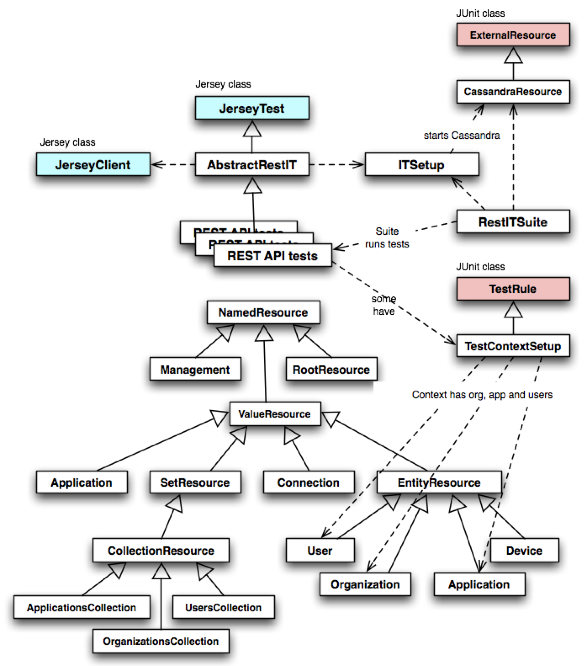

REST Tests Implementation Overview
===
This is an overview of the Usergrid REST API tests and how they work.

RestITSuite
---
This is a JUnit tests suite that runs all of the REST tests. 
Has a __CassandraResource__ which reads Cassandra config from a properties file

AbstractRestIT
---
All REST tests extend this abstract class, which extends the Jersey Test framework's __JerseyTest__. 
The class has an __ITSetup__ object which uses the RestITSuite's CassandraResource to start Cassandra.
Each instance of the classes has a Jersey client instance and makes it available for use in classes that extend.

REST Tests
---
All of these REST API tests extend __AbstractRestIT__.
Some tests call REST API directly with Jersey client.
Many of the tests use a JUnit-based __TestContextSetup__ Rule that provides a test framework.
This test framework is a set of classes that all extend __NamedResource__.

NamedResource
---
Provides a way to model the Usergrid REST API and execute HTTP requests against it.
A resource represents a REST resource and makes it easy to form Jersey Client WebResources
which can be used to call the REST resource.

You can see the Resource hierarchy in the diagram here:

